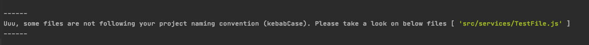

# Welcome to **[file-naming-enforcer](https://github.com/sztadii/file-naming-enforcer)**!

## Problem to solve

If your team wants to follow some file name conventions, <br />
like a capital case for classes for components or kebab case for styles or any other, <br />
then you should automate it and forget about the unnecessary discussion during code review. <br />

## How to install

```
npm i -D file-naming-enforcer
```

## How to use

```
"scripts": {
  "lint-components": "file-naming-enforcer type=capitalize folder=./src/components ext=js",
  "lint-styles": "file-naming-enforcer type=kebabCase folder=./src ext=scss",
  "lint-utils": "file-naming-enforcer type=camelCase folder=./src/utils ext=js",
  "lint-all": "file-naming-enforcer type=kebabCase ignore=[README.md,Dockerfile]",
}
```

## Expected result:

Once everything will be set up properly, <br />
and some files will be not following our project convention, <br />
then you should see below errors <br />


